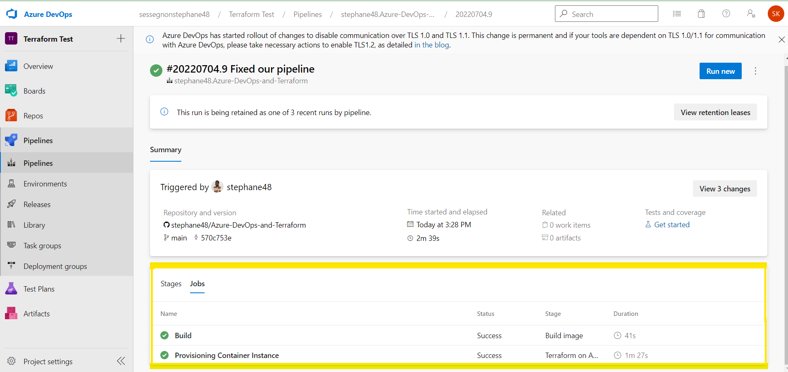
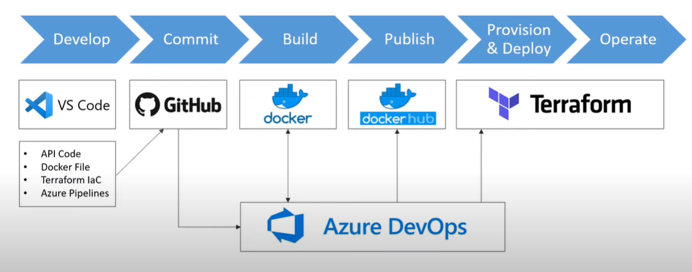

# Azure-DevOps-and-Terraform

## Azure Devops: Provisioning API Infrastructure using Terraform
In this project we have build a fully automated CI/CD pipeline using:
### .NET Core 3.1
The API has been designed using the .NET Core framework of C#. The API is about providing the date, time and various temperature (Celcius and Fahrenheit).
### Github 
Once we commit and push our code written on VS Code, Github will trigger our build in Azure Devops, now the CI sill start now. Github will tell us 
if the build is passed or failed.
### Docker 
- In VS code, we have created a docker file, that is going to create our docker image for our project
- In our Azurepieplie file, docker is going to build our docker image and push it in Docker Hub
### Docker Hub
In the pipeline, docker hub is wheer our docker image built will be stored
### Terraform
We use Terraform to create/update the infrastructure automatically for our API
- It helps us to create our resource group "tfminrg", under this resource group,it will create a container "weatherapi",
the container created will pull the docker image saved in docker hub and run it in the container
- Next, another resource group "tf_rd_blobstore" will be created, under that resource group, there will be a "Blob storage" created,
and another container will be created to store the terraform state file, kind of a backend
- All the step above will be implemented using the "main.tf" file
### Azure & Azure Devops

 
Azure is where the resources will be created 
Azure DevOps is where we will create the pipeline, to do so we needed to:
- set up the service connactions (Azure Resource, Docker Hub and GitHub) that will alow Azure DevOps to have access to these tools to run the pipeline
- set up Variables Library in Azure DevOps (ClicntID, Client SecretId, TenantId and SuscriptionId) that will give access to Terraform to be able to create
resource with doing "az login" in the terminal.
  
## Final DevOps Workflow

